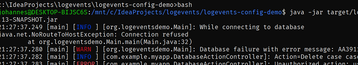
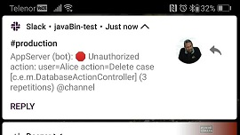
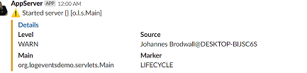
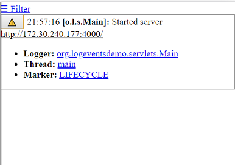
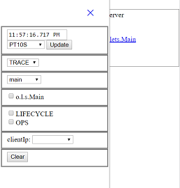

# Logevents - a simple SLF4J implementation

[](https://opensource.org/licenses/Apache-2.0)
[](https://maven-badges.herokuapp.com/maven-central/org.logevents/logevents)
[](http://www.javadoc.io/doc/org.logevents/logevents)
[](https://travis-ci.org/jhannes/logevents)
[](https://coveralls.io/github/jhannes/logevents?branch=master)
[](https://snyk.io/test/github/jhannes/logevents?targetFile=pom.xml)

Setting up and configuring logging should be *easy*, whether you want to do it with
configuration files or in code. Log Events is a small (265kb, *no dependencies*) logging framework
built on top of SLF4J - the logging lingua franka for Java.

Features:

* [Console logging](https://jhannes.github.io/logevents/apidocs/org/logevents/observers/ConsoleLogEventObserver.html) with good default colors (also on Windows)
* [File logging](https://jhannes.github.io/logevents/apidocs/org/logevents/observers/FileLogEventObserver.html) with reasonable defaults
* [JUnit support](https://jhannes.github.io/logevents/apidocs/org/logevents/extend/junit/ExpectedLogEventsRule.html) to easy assert on what is logged
* [Email logging](https://jhannes.github.io/logevents/apidocs/org/logevents/observers/SmtpLogEventObserver.html), including throttling to reduce spamming when get lots of log messages
* [Slack](https://jhannes.github.io/logevents/apidocs/org/logevents/observers/SlackLogEventObserver.html) to send log messages to you favorite chat channel
* [Microsoft Teams](https://jhannes.github.io/logevents/apidocs/org/logevents/observers/MicrosoftTeamsLogEventObserver.html)
* [Logging to database](https://jhannes.github.io/logevents/apidocs/org/logevents/observers/DatabaseLogEventObserver.html)
* [Display logs on a web dashboard](https://jhannes.github.io/logevents/apidocs/org/logevents/observers/WebLogEventObserver.html)
* [Elasticsearch](https://jhannes.github.io/logevents/apidocs/org/logevents/observers/ElasticsearchLogEventObserver.html). Logging directly to Elastic search Index API avoids edge cases when writing and parsing log files
* [Azure Application Insights](https://jhannes.github.io/logevents/apidocs/org/logevents/extend/azure/ApplicationInsightsLogEventObserver.html) (requires optional com.microsoft.azure:applicationinsights-core dependency)
* [JMX integration](https://jhannes.github.io/logevents/apidocs/org/logevents/jmx/LogEventsMBeanFactory.html) to view the configuration and tweak log levels

## Quick start:

1. Add `org.logevents:logevents:0.1.28` to your `pom.xml`. Right away, you will by default get logged event at INFO and higher to the console with a reasonable format, including color coding if your environment supports it. Your tests will log at WARN and the format will include which test method caused the log event.
2. Add `logevents.properties` to your current working directory or `src/main/resources` with the line `root=WARN` to only log warning and higher. You can also add for example `logger.my.package.name=DEBUG` to log a particular package at DEBUG level. Read more about [logevents.properties](https://jhannes.github.io/logevents/apidocs/org/logevents/config/DefaultLogEventConfigurator.html). If you want to get messages from the internals of LogEvents, add `logevents.status=DEBUG`.
3. Add `observer.console.threshold=WARN` and set `root=DEBUG file,console` to write debug log events to [the file](https://jhannes.github.io/logevents/apidocs/org/logevents/observers/FileLogEventObserver.html) `logs/<your-app-name>-%date.log` and warning events to [console](https://jhannes.github.io/logevents/apidocs/org/logevents/observers/ConsoleLogEventObserver.html).
4. Add the lines `observer.file.formatter=PatternLogEventFormatter`, `observer.file.formatter.pattern=%logger{20}: %message` and `observer.file.filename=logs/mylog-%date.txt` to change the file location and message format. See <a href="https://jhannes.github.io/logevents/apidocs/org/logevents/formatting/PatternLogEventFormatter.html">PatternEventLogFormatter</a> for more details.
5. You can add a [Slack observer](https://jhannes.github.io/logevents/apidocs/org/logevents/observers/SlackLogEventObserver.html) with little effort. [Get a slack webhook URL](https://www.slack.com/apps/) and add `observer.slack=SlackLogEventObserver`, `observer.slack.threshold=WARN` and `observer.slack.slackUrl=<your slack webhook url>`, then set `root=DEBUG file,console,slack`. If you prefer Microsoft Teams, you can use [MicrosoftTeamsLogEventObserver](https://jhannes.github.io/logevents/apidocs/org/logevents/observers/MicrosoftTeamsLogEventObserver.html) instead.
6. If your application is running in a servlet container, you can add the `observer.servlet=WebLogEventObserver` (see [WebLogEventObserver](https://jhannes.github.io/logevents/apidocs/org/logevents/observers/WebLogEventObserver.html)) and add the [LogEventsServlet](https://jhannes.github.io/logevents/apidocs/org/logevents/extend/servlets/LogEventsServlet.html) to your servlet container. Add `root.observer.servlet=DEBUG` to log debug and higher to the web console. See [OpenIdConfiguration](https://jhannes.github.io/logevents/apidocs/org/logevents/util/openid/OpenIdConfiguration.html) to learn how to secure your LogEventServlet. Alternatively, you can run the dashboard on an [embedded web server](https://jhannes.github.io/logevents/apidocs/org/logevents/web/LogEventHttpServer.html) by adding `observer.servlet.httpPort=8080`.
7. To make link to the Log Events dashboard in Slack messages, configure `observer.slack.formatter.detailUrl=<where you exposed your LogEventsServlet>`. In order to decrease the amount of potentially sensitive information logged to Slack, configure `observer.slack.formatter=SlackAlertOnlyFormatter` (similarly with MicrosoftTeamsAlertOnlyFormatter).
8. To save log message in a database between restarts and so load balanced nodes can view each others log messages, configure `observer.servlet.source=[WebLogEventObserver](https://jhannes.github.io/logevents/apidocs/org/logevents/observers/WebLogEventObserver.html)` and add the [LogEventsServlet](https://jhannes.github.io/logevents/apidocs/org/logevents/extend/servlets/LogEventsServlet.html) to your servlet container. Set `root=DEBUG file,console,slack,servlet` to enable.
9. To ensure that all uncaught exceptions in your application are logged, add `installExceptionHandler=true` to logevents.properties`

Here is a simple, but powerful [`logevent.properties`](https://jhannes.github.io/logevents/apidocs/org/logevents/config/DefaultLogEventConfigurator.html):

```
# Output LogEvents configuration to system err
logevents.status=DEBUG
logevents.installExceptionHandler=true
logevents.jmx=true

observer.slack=SlackLogEventObserver
observer.slack.slackUrl=....
observer.slack.formatter.sourceCode.1.package=org.logevents
observer.slack.formatter.sourceCode.1.maven=org.logevents/logevents

observer.console.threshold=WARN
# If you want LogEvents to output to standard error instead of standard out
observer.console.outputToSyserr=true

observer.servlet=WebLogEventObserver
observer.servlet.openIdIssuer=https://login.microsoftonline.com/.../v2.0
observer.servlet.clientId=..
observer.servlet.clientSecret=...
observer.servlet.source.jdbcUrl=jdbc:postgresql:logevents
observer.servlet.source.jdbcUsername=logevents
observer.servlet.source.jdbcPassword=33sg423sgaw21
observer.servlet.httpsPort=8443
observer.servlet.keyStore=my-ssl-keys.p12
observer.servlet.keyStorePassword=.....

observer.*.packageFilter=sun.reflect
observer.*.includeMdcKeys=clientIp, request

root=INFO file,console
root.observer.servlet=DEBUG
root.observer.slack=WARN
logger.org.example=DEBUG
```

Properties can also be read from environment variables, LOGEVENTS_OBSERVER_CONSOLE_THRESHOLD=ERROR or LOGEVENTS_OBSERVER_SERVLET_CLIENT_SECRET=abc123




### Slack message can contain link to web dashboard



### Web dashboard gives details of messages



### Web dashboard allows filtering of messages



You can also set up environment specific logging with a file named `logevents-<profile>.properties`, with environment variables or you can configure Logevents programmatically:

```
LogEventFactory logEventFactory = LogEventFactory.getInstance();

logEventFactory.setRootLevel(Level.ERROR);
logEventFactory.addRootObserver(new DateRollingLogEventObserver("target/logs/application.log"));

logEventFactory.setLevel("org.logevents", Level.INFO);
logEventFactory.addObserver("org.logevents", new DateRollingLogEventObserver("target/logs/info.log"));
```

Logevents tries to make concrete improvements compared to Logback:

* Most useful observers are included in the core packages without extra dependencies. In addition to the expected [console observer](https://jhannes.github.io/logevents/apidocs/org/logevents/observers/ConsoleLogEventObserver.html) and [file observer](https://jhannes.github.io/logevents/apidocs/org/logevents/observers/FileLogEventObserver.html), Logevents come with observers for [Slack](https://jhannes.github.io/logevents/apidocs/org/logevents/observers/SlackLogEventObserver.html), [Microsoft Teams](https://jhannes.github.io/logevents/apidocs/org/logevents/observers/MicrosoftTeamsLogEventObserver.html), [email](https://jhannes.github.io/logevents/apidocs/org/logevents/observers/SmtpLogEventObserver.html) and [web](https://jhannes.github.io/logevents/apidocs/org/logevents/observers/WebLogEventObserver.html) built in. (With time, Elastic Search and Splunk will also be included out-of-the-box)
* Simpler programmatic configuration by dropping logback's `LifeCycle` concept
* More navigable code base with less indirection
* Fewer architectural concepts: Log Events is build almost exclusively around an observer pattern.
* More concise documentation
* No dependencies. Even the minimal JSON processing is done without forcing you to add any additional library


## Architecture


## An introduction to logging with SLF4J

This section is about SLF4J more than just about Logevents. It can be useful even if you
are not using Logevents. The [SLF4J documentation](https://www.slf4j.org/manual.html)
is a bit exhaustive and not to-the-point.

SLF4J (Simple Logging Facade for Java) is the most used framework by libraries
and applications for logging. It contains only interfaces and an application is
required to include an implementation such as Logback, Logevents, slf4j-log4j or
slf4j-jul to capture the logs.


### Basic logging

In order to log to SLF4J, include the `slf4j-api` dependency with Maven (or gradle):

```xml
<dependency>
    <groupId>org.slf4j</groupId>
    <artifactId>slf4j-api</artifactId>
    <version>1.7.25</version>
</dependency>
```

**In addition, you must include a slf4j implementation.**

You can log from your own code by getting a `Logger`:

```java
import org.slf4j.Logger;
import org.slf4j.LoggerFactory;

public class DemoClass {

    private static Logger logger = LoggerFactory.getLogger(DemoClass.class);

    public static void main(String[] args) throws IOException {
        logger.warn("Something went wrong");
    }
}
```

### Including information

You can include data in your logging statement - if the event is never printed
(for example if `debug` level is not active), `toString()` is never called
on the message arguments:

```
logger.debug("Response from {}: {}", url, responseCode);
```


You can include an exception. A logging implementation will generally print the
whole stack trace of the exception:

```
try {
    ...
} catch (IOException e) {
    logger.error("Failed to communicate with {}", url, e);
}
```

If you want to avoid a costly operation when the event is suppressed, you can
use `isDebugEnabled`, `isWarnEnabled` etc. In this example, if the logging
level is warn or error, `parsePayload` is never called.

```
if (logger.isInfoEnabled()) {
	logger.info("Message payload: {}", parsePayload());
}
```


### MDC (Mapped Diagnostic Context)

Mapped Diagnostic Context, or MDC, can associate information with the
current thread. This information can be used by the log implementation to
filter messages, redirect messages to different destinations or include in
the output.

It's important to clean up the MDC after use, or MDC values can show up for
another request.

Example of usage:

```java
public class LoggingFilter implements javax.servlet.Filter {
    @Override
    public void doFilter(ServletRequest request, ServletResponse resp, FilterChain chain)
            throws IOException, ServletException {
        try {
            HttpServletRequest req = (HttpServletRequest)request;
            MDC.put("client-ip", req.getRemoteAddr());
            MDC.put("RequestContext", Optional.ofNullable(req.getHeader("X-Request-Context"))
                    .orElseGet(() -> UUID.randomUUID().toString()));
            MDC.put("user", req.getRemoteUser());
            
            chain.doFilter(req, resp);
        } finally {
            MDC.clear();
        }
    }
}
```

You can configure the logging implementation (logevents or logback) to use the MDC, or you
can even use it from your own code:

```
HttpURLConnection connection = (HttpURLConnection) serviceUrl.openConnection();
connection.setRequestProperty("X-Request-Context", MDC.get("RequestContext"));

```


## Configuring SLF4J and Logevents

### General SLF4J configuration

1. Include the org.logevents:logevents maven dependency
2. Setup log configuration
   a. If nothing is set up, WARN and higher are logged to console
   b. You can get the `LogEventFactory.getInstance()` directly and set up everything programmatically
   c. If you don't, Logevents will use the Java Service Loader framework to locate an instance of `org.logevents.LogEventConfigurator` interface
   d. The default `LogEventConfiguration` will attempt to determine the current profile and load `logevents-<profile>.properties` and `logfile.properties`


### Configuring SLF4J with Logevents

Include Logevents maven dependency:

```xml
<dependency>
    <groupId>org.logevents</groupId>
    <artifactId>logevents</artifactId>
    <version>0.1.23</version>
</dependency>
```

### Configuring Log Events programmatically

Use `LogEventFactory` to set up the configuration from your
main method before calling any logging code:


```
LogEventFactory factory = LogEventFactory.getInstance();
factory.setRootLevel(Level.WARN);
factory.setRootObserver(CompositeLogEventObserver.combine(
        new ConsoleLogEventObserver(),
        new FileLogEventObserver()
        ));
factory.setLevel("org.myapp", Level.INFO);
factory.setObserver("org.myapp",
        new DateRollingLogEventObserver("log/info.log"));

factory.setObserver("org.logevents",
        new MyCustomSlackLogEventObserver());
```

### Configuring Log Events with Service Loader

If you want to ensure that your configuration is loaded before anything
else happens, you can use the Java Service Loader framework.

1. Create a class that implements <a href="https://jhannes.github.io/logevents/apidocs/org/logevents/LogEventConfigurator.html">`LogeventsConfigurator`</a>
2. Create a file in `META-INF/services/org.logevents.LogEventConfigurator`
   containing the qualified class name of your configurator.

For example:

```java
package com.example.myapp;

import org.logevents.LogEventConfigurator;

public class MyAppConfigurator implements LogEventConfigurator {
    @Override
    public void configure(LogEventFactory factory) {
        factory.setRootLevel(Level.WARN);
        factory.setRootObserver(new ConsoleLogEventObserver(), false);
    }
}
```

This is loaded with the following `META-INF/services/org.logevents.LogEventConfigurator`:

```
com.example.myapp.MyAppConfigurator
```


### Configuring Log Events with a properties file

The <a href="https://jhannes.github.io/logevents/apidocs/org/logevents/config/DefaultLogEventConfigurator.html">
default `LogEventConfigurator`</a> will try to determine the current profile,
using the system properties `profiles`, `profile`, `spring.profiles.active` or
the environment variables `PROFILES`, `PROFILE` or `SPRING_PROFILES_ACTIVE`.
If running in JUnit, the profile `test` will be active by default.

`DefaultLogEventConfiguration` will try to load `logevents.properties` and
`logevents-<profile>.properties` for any properties set in one of the profile
environment variables or system properties.

The properties files is read from the classpath and from the current working directory,
which is also watched for changes in the files.

The properties-file is on the following format:

```
observer.<observerName>=<observerClassName or alias>
observer.<observerName>.<propertyKey>=<property value>

logger.<category>=[<LEVEL> ]<observerName>
includeParent.<category>=false

root=[<LEVEL> ]<observerName>
```

For observers in `org.logevents.observers` package, the package name
can be omitted - so `ConsoleEventObserver` and be used instead of
`org.logevents.ConsoleEventObserver`.


### PatternLogEventFormatter and ExceptionFormatter

If you do programmatic configuration, the recommended approach is to implement
message formatting in code. See <a href="https://jhannes.github.io/logevents/apidocs/org/logevents/observers/ConsoleLogEventObserver.html">`ConsoleLogEventFormatter`</a> as an example.

However, if you use properties files for configuration, you will probably
want to use <a href="https://jhannes.github.io/logevents/apidocs/org/logevents/formatting/PatternLogEventFormatter.html">`PatternLogEventFormatter`</a> to format the log events. Here
is an example:

```
observer.file=FileLogEventObserver
observer.file.filename=logs/application-%date.log
observer.file.formatter=PatternLogEventFormatter
observer.file.formatter.pattern=%date{HH:mm:ss} %highlight([%5level]) [%thread] [%mdc{user:-<no user>}] %logger{20}: %message
observer.file.formatter.exceptionFormatter=CauseFirstExceptionFormatter
observer.file.formatter.exceptionFormatter.packageFilter=sun.nio, my.internal.package

root=INFO file
```

The following conversion words are supported:

* `%date{<format>, <timezone>}`: The time when the log event was generated. Examples:
  `%date{HH:mm:ss, UTC}`. The parameters are passed to `DateTimeFormatter.ofPattern()`
  and `ZoneId.of()` respectively
* `%logger{<length>}`: The name of the logger (the parameter to LoggerFactory.getLogger())
* `%message`: The formatted message of the log event, with "{}" replaced by log arguments
* `%thread`: The thread that created the log event
* `%class`: The class name of the caller of the log event
* `%method`: The class method of the caller of the log event
* `%file`: The file name of the caller of the log event
* `%line`: The line number of the caller of the log event
* `%mdc{<key>:-<default>}`: The value of the specified MDC variable.
   `%mdc` outputs all MDC variables.
* `%highlight(<sub pattern>)` will format the sub-pattern as normal and output
  the text in a color appropriate for the log level of the event
* `%red(<sub pattern>)`, `%green(<sub pattern>)`, `%blue(<sub pattern>)`, etc
  formats the message according to the sub pattern and outputs it in the given color

As opposed to log4j and logback, logevents don't consider exception formatting as part
of the normal formatting pattern. Instead, you must set `.pattern.exceptionFormatter`
to customize the output of exceptions. On the upside, this means that it's
quite easy to create and plug in your own classes for exception formatting.


### Intercepting log4j and JUL logging

SLF4J comes out of the box with a bridge from java.util.logging
(jul-to-slf4j) and log4j (log4j-to-slf4j). This is very useful if
you are using a third party library which uses one of these
logging implementations (for example Tomcat). For log4j, you
simply need to include a dependency in your `pom.xml`:

**For log4j:**

```xml
<dependency>
    <groupId>org.slf4j</groupId>
    <artifactId>log4j-to-slf4j</artifactId>
    <version>1.7.25</version>
</dependency>
```

**For java.util.logging**

LogEvents will intercept java.util.logging by default. It will override
the current Handlers the first time `LoggerFactory.getLogger()` is called.


## Advanced usage patterns

### Batching

For some observers, it makes more sense to not send messages at once, but rather
wait until we know there aren't more messages coming. This is useful for example
when sending email (where you would often rather wait a minute and get a full list
of log messages in one email) or Slack (where you may want to have a cool down
period before sending more messages). Here is an example of how you can set up
a batching log event observer:

```
LogEventFactory factory = LogEventFactory.getInstance();
factory.setRootLevel(Level.INFO);

// Get yours at https://www.slack.com/apps/manage/custom-integrations
URL slackUrl = new URL("https://hooks.slack.com/services/....");
SlackLogEventBatchProcessor slackLogEventBatchProcessor = new SlackLogEventBatchProcessor(slackUrl);
slackLogEventBatchProcessor.setUsername("MyApplication");
slackLogEventBatchProcessor.setChannel("test");

BatchingLogEventObserver batchEventObserver = new BatchingLogEventObserver(slackLogEventBatchProcessor);
batchEventObserver.setCooldownTime(Duration.ofSeconds(5));
batchEventObserver.setMaximumWaitTime(Duration.ofMinutes(3));
batchEventObserver.setIdleThreshold(Duration.ofSeconds(3));
factory.setRootObserver(CompositeLogEventObserver.combine(
        new LevelThresholdConditionalObserver(Level.WARN, batchEventObserver),
        new ConsoleLogEventObserver()));
```

Or with properties files:

```
observer.slack=SlackLogEventObserver
observer.slack.threshold=WARN

observer.slack.cooldownTime=PT10S
observer.slack.maximumWaitTime=PT1M
observer.slack.idleThreshold=PT5S
observer.slack.slackUrl=https://hooks.slack.com/services/xxxx/xxxxx

logger.org.logeventsdemo.Main=DEBUG slack

```

### Slack

Logevents comes with an example implementation of logging to Slack in
the form of `SlackLogEventBatchProcessor`. You can subclass this to customize
your Slack messages.

`SlackLogEventBatchProcessor` can link your stack traces directly to your
source code repository. Currently, Github and Bitbucket 5 URLs are supported.
Examples:

```properties
observer.slack.formatter.sourceCode.1.packages=org.logevents
# See if META-INF/maven/org.logevents/logevents/pom.xml is available
#  If so, look for the <scm> tag in the pom-file
observer.slack.formatter.sourceCode.1.maven=org.logevents/logevents

observer.slack.formatter.sourceCode.2.packages=org.slf4j
# Link to Github
observer.slack.formatter.sourceCode.2.github=https://github.com/qos-ch/slf4j
observer.slack.formatter.sourceCode.2.tag=v_1.7.25

observer.slack.formatter.sourceCode.3.packages=com.example
# Link to Bitbucket: https://bitbucket.example.com/EX/project/src/main/java/<java-path>?at=release#<line>
observer.slack.formatter.sourceCode.3.github=https://bitbucket.example.com/EX/project/
observer.slack.formatter.sourceCode.3.tag=release
```


### Servlets

Logevents comes with two servlets that you can add to your servlet container.

`org.logevents.extend.servlets.LogEventsServlet.doGet` can list up
log events as JSON (to be formatted by your own JavaScript). It supports
four optional query parameters: `level` (default INFO), `category`, `offset`
and `count`.  (TODO)

`org.logevents.extend.servlets.LogEventConfigurationServlet`:
`doGet` lists up all active loggers and observers as JSON.
`doPost` allows to change the level and observer (TODO) for a single logger.


### JUnit

If no configuration is loaded, Logevents logs at WARN level to the console.
This is appropriate for most test scenarios. If you want your tests to suppress
and specify which log messages they expect, you can use the included
[ExpectedLogEventsRule](https://jhannes.github.io/logevents/apidocs/org/logevents/extend/junit/ExpectedLogEventsRule.html).

For example:

```java
public class ExpectedLogEventsRuleTest {

    private Logger logger = LoggerFactory.getLogger("com.example.application.Service");

    @Rule
    public ExpectedLogEventsRule rule = new ExpectedLogEventsRule(Level.WARN, factory);

    @Test
    public void shouldCaptureLogEvent() {
        rule.expectMatch(expect -> expect
                .level(Level.WARN).logger(ExpectedLogEventsRuleTest.class)
                .pattern("This is a {} test for {}").args("nice", "LogEvents"));

        logger.warn("This is a {} test for {}", "nice", "LogEvents");
    }
}
```


## Questions and answers

### Why not logback

When designed, logback was created with a lot of flexibility for mind for
possible future requirements. As it has become in wider use, much of this
flexibility has remained untapped, while the architecture is paying the cost in
increased indirection.

Based on the experience from using Logback, Logevents is trying to only support
the flexibility that used in the most common scenarios for Logback. This means
there may be things Logback can do that Logevents will be unable to handle.
On the other hand, most of the common extension scenarios will probably require
less code to implement with Logevents.

If you find yourself wanting to extend Logback but bogged down by the amount of
work needed, you will probably find Logevents much easier to build upon.

As a result of this, Logevents comes with a lot of features built in that require
custom extensions with Logback, such as integration with Slack, Elasticsearch,
and Application Insights and a built-in web console.


### How do I migrate from Logback?

If you're using logback today and would like to check out logevents, here's a simple step-by-step guide:

1. Check the expected effort: Remove the `logback` dependencies from your `pom.xml` (or `build.gradle`) and rebuild to see how much code directly references Logback. Chances are that this is nothing or very little.
   * If you have appenders built with Logback that may have general interest, feel free to <a href="https://github.com/jhannes/logevents/issues">submit an issue</a> to have me create a Log Events observer for the appender
2. Check your `logback.xml` files (and possibly `logback-spring.xml`). This will let you know what appenders you use. Setting up the equivalent in Logevents should be considerably less configuration.
   * If you have using appenders from Logback that you miss in Logevents or if the configuration is simpler in Logback, feel free to <a href="https://github.com/jhannes/logevents/issues">submit an issue</a> to have me create a Log Events observer for the appender


### TODO

* [ ] logevent.html:
   * [ ] Test for multiple MDCs/mdc sorting
   * [ ] pagination
   * [ ] Show LogEventStatus in logevents.html
   * [ ] negative marker and category filter
   * [ ] large number of categories?
* [ ] Performance
   * [ ] 100 parallel threads logging to database and file
* [ ] Standard statistics root logger

